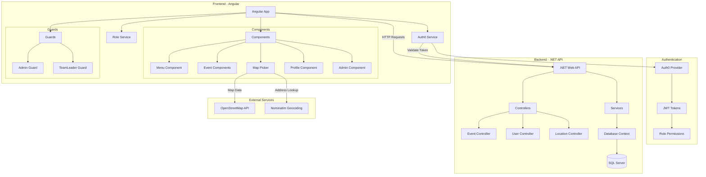

# Evento - Event Management Application

Een moderne event management applicatie gebouwd met Angular en Auth0 authenticatie, ondersteund door een .NET backend API.

## 🚀 Technologie Stack

- **Frontend**: Angular 18 met Material Design
- **Backend**: .NET Web API
- **Authenticatie**: Auth0 met rol-gebaseerde toegangscontrole
- **Kaarten**: Leaflet.js voor locatie selectie
- **Database**: SQL Server (via .NET backend)

## 📋 Features

- ✅ Gebruikersauthenticatie via Auth0
- ✅ Rol-gebaseerd toegangsbeheer (Admin, TeamLeader, User)
- ✅ Event management (aanmaken, bewerken, bekijken)
- ✅ Interactieve kaart voor locatie selectie
- ✅ Responsive design met mobile menu
- ✅ Profiel beheer
- ✅ Admin dashboard voor gebruikersbeheer

## 🏗️ Applicatie Architectuur



## 🔐 Rol-gebaseerde Toegang

| Rol | Permissions | Toegang |
|-----|-------------|---------|
| **User** | Basis toegang | Events bekijken, Profiel beheren |
| **TeamLeader** | `create:event` | + Events aanmaken, Locaties beheren |
| **Admin** | `read:admin` | + Alle gebruikers beheren, Systeem configuratie |

## 🛠️ Development Setup

### Prerequisites
- Node.js (v18+)
- Angular CLI (`npm install -g @angular/cli`)
- .NET 8 SDK
- SQL Server of SQL Server Express

### Frontend Setup
```bash
# Clone repository
git clone <repository-url>
cd WorkShopAngularAuth0

# Install dependencies
npm install

# Start development server
ng serve --open
```


### Environment Configuration
Create `src/environments/environment.development.ts`:
```typescript
export const environment = {
  production: false,
  auth0: {
    domain: 'your-auth0-domain',
    clientId: 'your-client-id',
    audience: 'your-api-audience'
  },
  apiUrl: 'https://localhost:7001/api',
  home_url: 'http://localhost:4200'
};
```

## 🗺️ Map Integration

De applicatie gebruikt **Leaflet.js** voor interactieve kaart functionaliteit:

- **Map Picker Component**: Klik op kaart om locatie te selecteren
- **Reverse Geocoding**: Automatisch adres opzoeken via OpenStreetMap
- **Responsive Design**: Werkt op desktop en mobile

```typescript
// Voorbeeld gebruik van Map Picker
<app-map-picker (locationSelected)="onLocationSelected($event)"></app-map-picker>
```


## 🔧 Available Scripts

| Command | Description |
|---------|-------------|
| `ng serve` | Start development server |
| `ng build` | Build for production |
| `ng test` | Run unit tests |

## 📝 Project Structure

```
src/
├── app/
│   ├── components/          # UI Components
│   ├── guards/             # Route Guards
│   ├── services/           # Business Logic
│   ├── models/             # TypeScript Interfaces
│   └── environments/       # Configuration
├── assets/                 # Static Assets
└── styles/                # Global Styles
```


## 📄 License

Dit project is onderdeel van een Angular workshop en is bedoeld voor educatieve doeleinden.